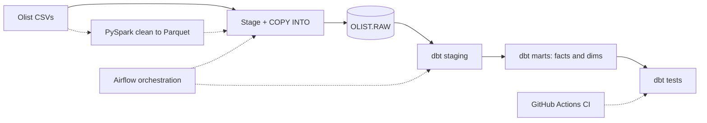

# Architecture

Solid lines are the MVP. Dashed lines are planned expansions.

```mermaid
flowchart LR
  csv["Olist CSVs"] --> load["Stage + COPY INTO"]
  csv -.-> spark["PySpark clean to Parquet"]
  spark -.-> load
  load --> raw[("OLIST.RAW")]
  raw --> stg["dbt staging"]
  stg --> marts["dbt marts: facts and dims"]
  marts --> tests["dbt tests"]
  airflow["Airflow orchestration"] -.-> load
  airflow -.-> stg
  ci["GitHub Actions CI"] -.-> tests
```
